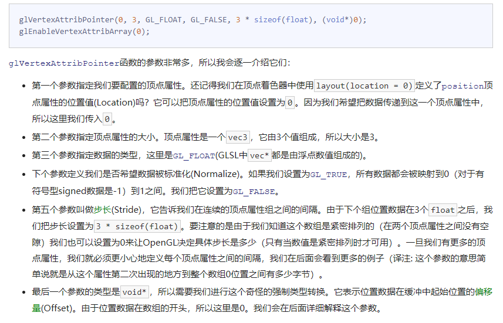

## <center>OpenGl

参考教程： [learnOpenGlCn](https://learnopengl-cn.github.io/)

## GLFW
GLFW是一个专门针对OpenGL的C语言库，它提供了一些渲染物体所需的最低限度的接口。因此，底层使用glfw构建。

## GLAD
GLAD是一个开源的库，用于解决OpenGl对于不同的显卡厂商，相同函数的函数地址在编译时不确定的问题。

## 窗口

```C++
int main()
{
    glfwInit();
    glfwWindowHint(GLFW_CONTEXT_VERSION_MAJOR, 3);
    glfwWindowHint(GLFW_CONTEXT_VERSION_MINOR, 3);
    glfwWindowHint(GLFW_OPENGL_PROFILE, GLFW_OPENGL_CORE_PROFILE);
    //glfwWindowHint(GLFW_OPENGL_FORWARD_COMPAT, GL_TRUE);

    return 0;
}
```
glfwInit(); 用于初始化glfw，glfwWindowHint，设置glfw大小版本号，并使用core模式。

创建窗口
```C++
GLFWwindow* window = glfwCreateWindow(800, 600, "LearnOpenGL", NULL, NULL);
if (window == NULL)
{
    std::cout << "Failed to create GLFW window" << std::endl;
    glfwTerminate();
    return -1;
}
glfwMakeContextCurrent(window);
```

初始化GLAD,管理指针地址
```C++
if (!gladLoadGLLoader((GLADloadproc)glfwGetProcAddress))
{
    std::cout << "Failed to initialize GLAD" << std::endl;
    return -1;
}
```
设置渲染窗口（可以小于主窗口）
```C++
glViewport(0, 0, 800, 600);
```

注册回调函数，告诉GLFW窗口改变时，跟随渲染
```C++
glfwSetFramebufferSizeCallback(window, framebuffer_size_callback);
```
为了保证窗口常显示，我们使用循环，渲染

```C++
while(!glfwWindowShouldClose(window))
{
    glfwSwapBuffers(window);
    glfwPollEvents();    
}
```
最后，程序结束，释放资源文件
```C++
glfwTerminate();
return 0;
```

此外，我们添加一些按键输入作为回调函数
```C++
void processInput(GLFWwindow *window)
{
    if(glfwGetKey(window, GLFW_KEY_ESCAPE) == GLFW_PRESS)
        glfwSetWindowShouldClose(window, true);
}
```

有时，我们不需要有鼠标，可以聚焦到屏幕

```C++
glfwSetInputMode(window, GLFW_CURSOR, GLFW_CURSOR_DISABLED);
```

总体的渲染还击大致为:
```C++
// 渲染循环
while(!glfwWindowShouldClose(window))
{
    // 输入
    processInput(window);
    
    glClearColor(0.2f, 0.3f, 0.3f, 1.0f);
    //情况屏幕缓冲颜色，并以glClearColor中的颜色填充
    glClear(GL_COLOR_BUFFER_BIT);
    // 渲染指令
    ...

    // 检查并调用事件，交换缓冲
    glfwPollEvents();
    glfwSwapBuffers(window);
}
```

## 绘制三角形

准备一个简单的三角形数据

```C++
float transparentVAO[] = {
    0.0f,  0.5f,  0.0f,  0.0f,  0.0f,
    0.0f, -0.5f,  0.0f,  0.0f,  1.0f,
    1.0f, -0.5f,  0.0f,  1.0f,  1.0f,
    0.0f,  0.5f,  0.0f,  0.0f,  0.0f,
    1.0f, -0.5f,  0.0f,  1.0f,  1.0f,
    1.0f,  0.5f,  0.0f,  1.0f,  0.0f
};
```
 其标准化的绑定流程大致为：

 ```C++
 // transparent VAO
 //创建顶点缓存对象Vertex Buffer Objects, VBO，其作为OpenGl对象每次创建都具有唯一的ID
 //顶点数组对象(Vertex Array Object, VAO)可以像顶点缓冲对象那样被绑定,任何随后的顶点属性调用都会储存在这个VAO中
unsigned int transparentVAO, transparentVBO;
glGenBuffers(1, &transparentVBO);
glBindVertexArray(transparentVAO);
glGenVertexArrays(1, &transparentVAO);
//OpenGl具有很多个缓存对象，顶点缓冲对象的缓冲类型是GL_ARRAY_BUFFER
//从这一刻起，我们使用的任何（在GL_ARRAY_BUFFER目标上的）缓冲调用都会用来配置当前绑定的缓冲(VBO)
glBindBuffer(GL_ARRAY_BUFFER, transparentVBO);
//glBufferData专门把用户定义的数据复制到当前绑定缓冲对象，顶点缓冲对象当前绑定到GL_ARRAY_BUFFER目标上，
//第二个参数则是待绑定对象的大小
//第三个参数是我们希望发送的实际数据
//第四个参数表示数据改如何配置，
//GL_STATIC_DRAW ：数据不会或几乎不会改变。GL_DYNAMIC_DRAW：数据会被改变很多。GL_STREAM_DRAW ：数据每次绘制时都会改变
glBufferData(GL_ARRAY_BUFFER, sizeof(transparentVertices), transparentVertices, GL_STATIC_DRAW);
//启用顶点属性
glEnableVertexAttribArray(0);
glVertexAttribPointer(0, 3, GL_FLOAT, GL_FALSE, 5 * sizeof(float), (void*)0);
glEnableVertexAttribArray(1);
glVertexAttribPointer(1, 2, GL_FLOAT, GL_FALSE, 5 * sizeof(float), (void*)(3 * sizeof(float)));
glBindVertexArray(0);
 ```
 

可以使用``glPolygonMode(GL_FRONT_AND_BACK, GL_LINE)``函数配置OpenGL如何绘制图元，第一个参数表示我们打算将其应用到所有的三角形的正面和背面，第二个参数告诉我们用线来绘制。之后的绘制调用会一直以线框模式绘制三角形，直到我们用``glPolygonMode(GL_FRONT_AND_BACK, GL_FILL)``将其设置回默认模式。
