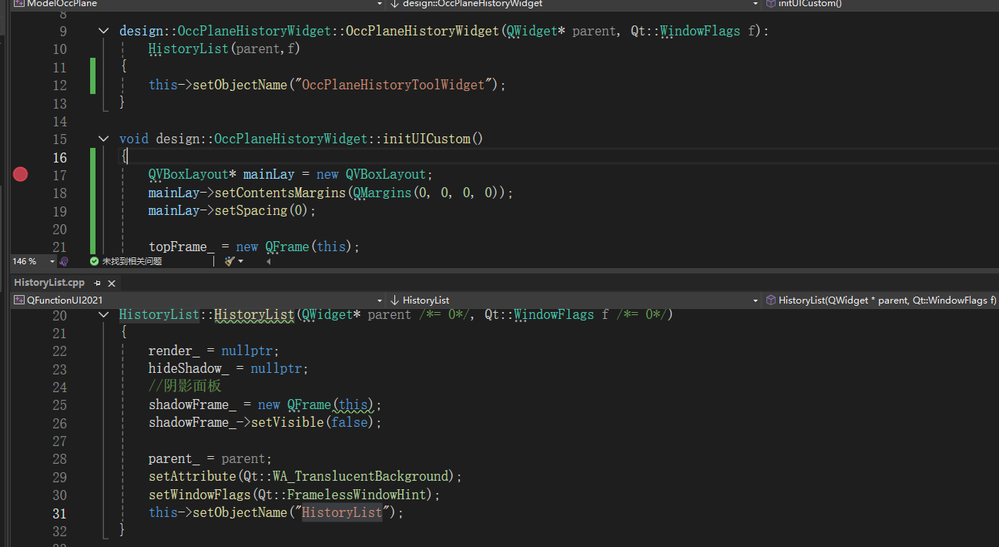

### QT 的ui有太对坑了，这边记录一些我工作中遇到的一些情况

## 例1 关于对组件设置样式表无效的问题
对 B 类（A 类的子类）中的一个组件设置样式表时，
使用 A#objectName 有效而 B#objectName 无效


可以看到父类的名称是**HistoryList**，而子类的组件名称为**OccPlaneHistoryToolWidget**，当我们在样式表文件中设置样式时：

```css
/*样式A*/
HistoryList#OccPlaneHistoryToolWidget
{
	background:#07ffa0;
	min-height: 73px;
	max-height: 73px;
	min-width: 240px;
	max-width: 240px;
	border-top-right-radius:12px;
	border-top-left-radius:12px;
}
/*样式B*/
OccPlaneHistoryWidget#OccPlaneHistoryToolWidget
{
	background:#07ffa0;
	min-height: 73px;
	max-height: 73px;
	min-width: 240px;
	max-width: 240px;
	border-top-right-radius:12px;
	border-top-left-radius:12px;
}
```
使用样式B是没有生效，而使用样式A可以生效。但其实该组件对应的类名为**OccPlaneHistoryWidget**。

## 例2 设置阴影的两种常见方式
对于设置阴影边框，通常有两种做法
1. 方法一
	```C++
	void UPOccPlanePanel::paintEvent(QPaintEvent*)
	{
		QPainter painter(this);
		painter.setRenderHint(QPainter::Antialiasing, true);

		QColor color(200, 200, 200);
		for (int i = 0; i < ROUNDOFFSET; i++)
		{
			color.setAlpha(120 - sqrt(i) * 60);
			painter.setPen(color);
			//drawRoundedRect 绘制带圆角
			painter.drawRoundedRect(ROUNDOFFSET - i, ROUNDOFFSET - i, this->width() - (ROUNDOFFSET - i) * 2, this->height() - (ROUNDOFFSET - i) * 2, 12, 12);
		}
	}
	```
这种方法是可行的，但前提是需要把主组件变大，即在原本的基础上变大2*ROUNDOFFSET大小。在调整UI布局的需要小心。

2. 方法二
	```C++
	shadowFrame_ = new QFrame(this);
	shadowFrame_->setVisible(false);
	shadowFrame_->setObjectName("Preview_shadowFrame");
	shadowFrame_->setStyleSheet("border:0px solid #f7f7f7; background:rgb(247, 247, 247);border-radius:12px; margin:4px;");//background:rgb(0, 247, 247);
	QGraphicsDropShadowEffect* shadow = new QGraphicsDropShadowEffect;
	//设置阴影距离
	shadow->setOffset(0, 0);
	//设置阴影颜色
	shadow->setColor(QColor(200, 200, 200));
	//设置阴影圆角
	shadow->setBlurRadius(20);
	//给嵌套QWidget设置阴影
	shadowFrame_->setGraphicsEffect(shadow);
	shadowFrame_->setGeometry(0, 0, this->size().width(), this->size().height());
	```
这也是常用的生成阴影的方式。但我在使用过程中经常显示不出任何东西。这里需要注意**background:rgb(247, 247, 247)**，如果shadowFrame_没有设置颜色，那么不光shadowFrame_不会显示，连阴影也没显示。其外，还需要注意shadowFrame_的大小需要和this的带下一致。有时若出现不一致的情况，需要重写resizeEvent。

## 例三 描述QPushButton的两个信号clicked以及toggled

对于前者，我看到的描述是否是checkable的，只要点击按钮，信号就会被出发。对于后者，只有按钮处于isCheckable状态，信号才会触发。这两者的区别主要在于。对于单次按钮，比如重置，关闭等操作，使用clicked比较好。对于表述某种状态的，比如静音按钮，一般都是有状态的，使用后者的信号比较好。


