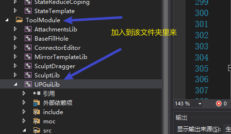
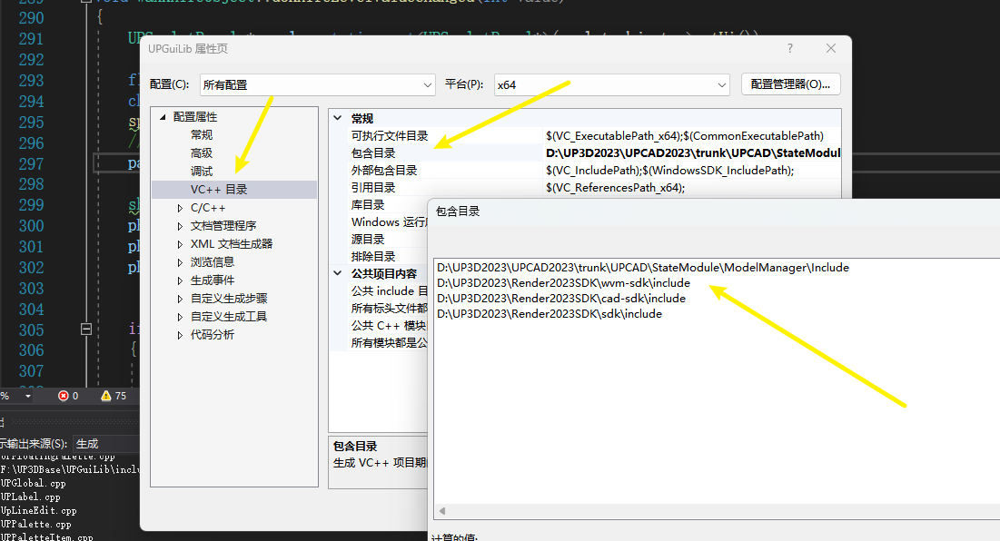
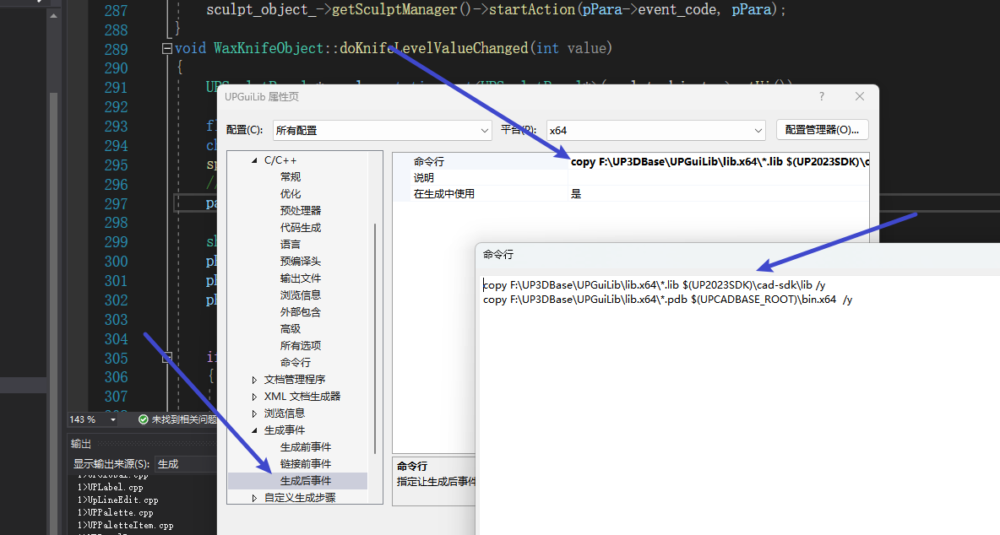
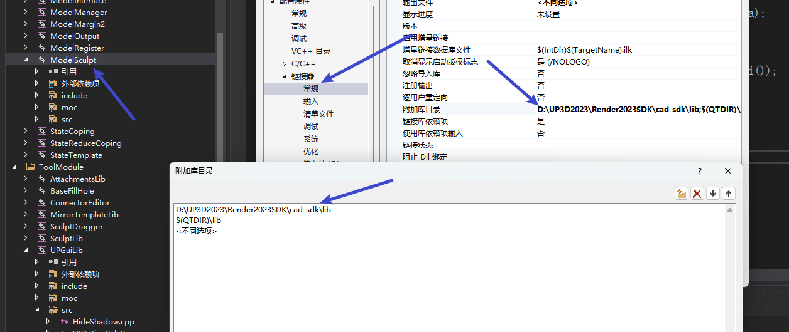
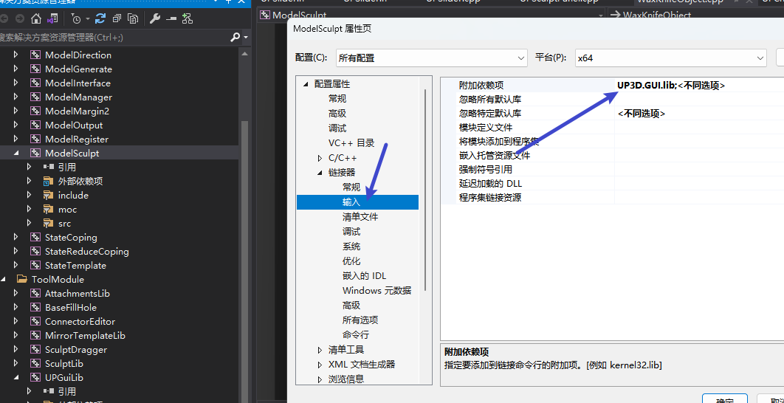

# 需要用到某个文件的CPP文件时。发现只有.h文件，这个时候需要考虑加入库文件

首先去搜索搜索一下其他文件夹（该工程文件之外）有没有CPP文件

有，找到其对应的工程，并在VS中添加该工程。，一般用作静态库
*********



先编译一下，看看缺了那些库文件；

一般是缺了SDK的一些头文件，这时需要将其加进来



这里的***包含目录***一般就是头文件缺失的问价所在的#include 文件夹所在地

*********




这里需要将编译后生成的静态库文件.lib以及调试文件.pdb文件输出到SDK文件夹，这里我用命令行分别将其复制到了cad-sdk文件夹中的lib文件夹以及工作目录（一般就是.exe文件所在目录）下。

命令行如下:

```cmd
copy F:\UP3DBase\UPGuiLib\lib.x64\*.lib $(UP2023SDK)\cad-sdk\lib /y
copy F:\UP3DBase\UPGuiLib\lib.x64\*.pdb $(UPCADBASE_ROOT)\bin.x64  /y
```

**********
最后，在转到前面缺失静态库的工程






在链接器常规中，添加前面生成的静态库所在的文件夹目录（lib）。
在输入选项中，添加对应的静态库文件名字。