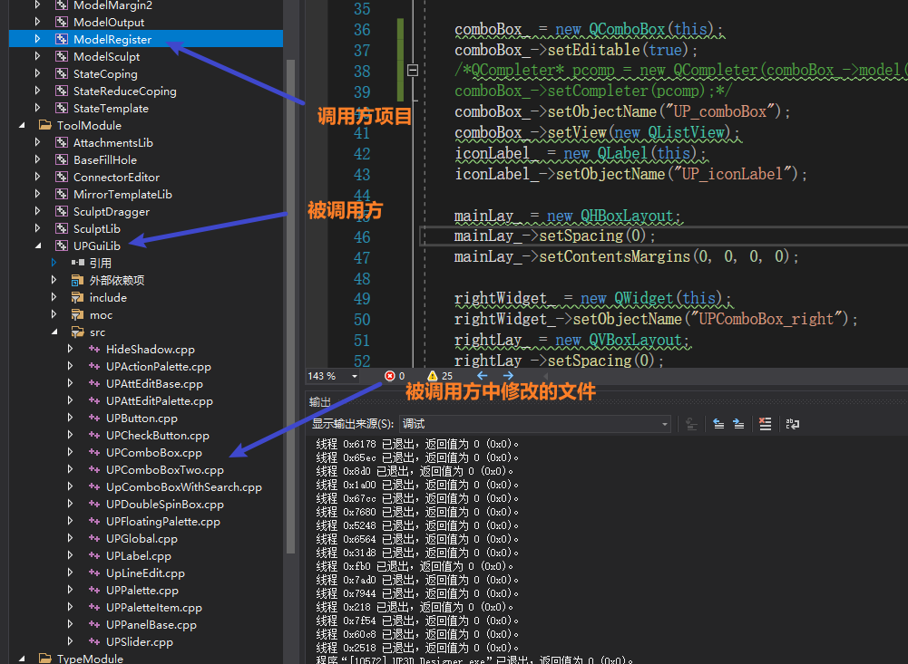
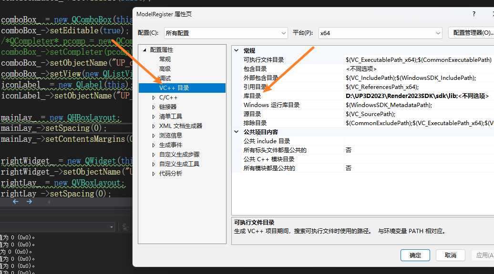
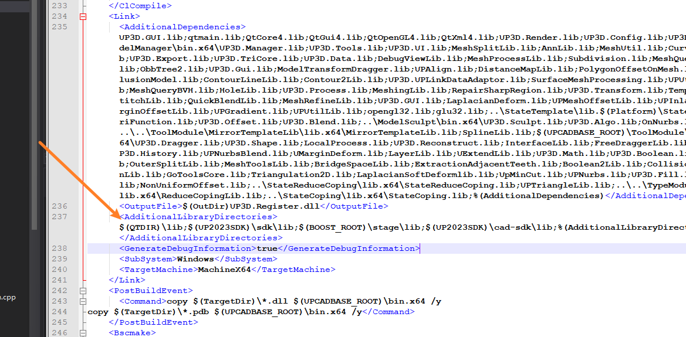
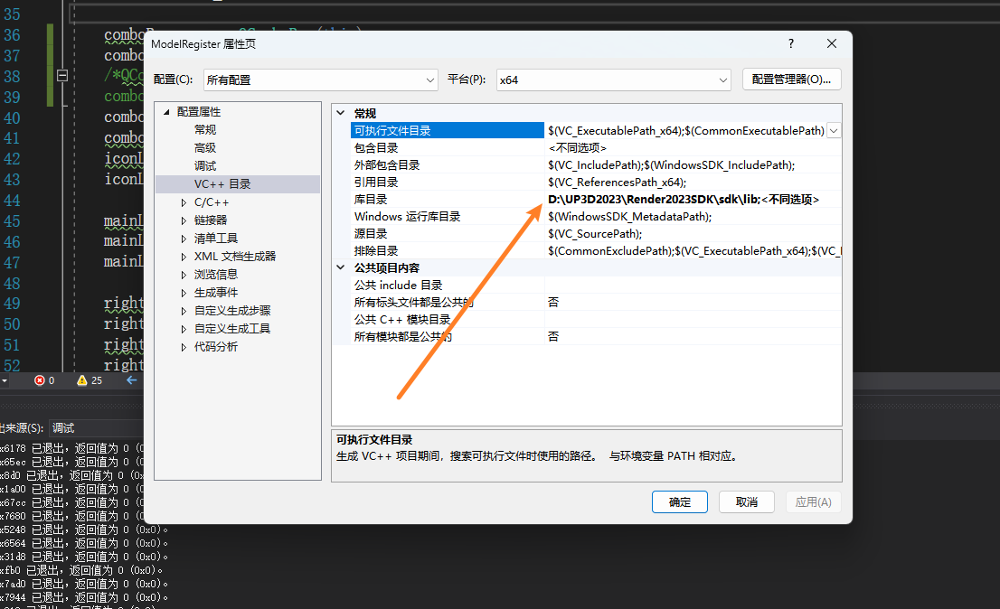

# 又出问题了，再次出现同一个项目下部分文件无法调试的问题

******

## 问题描述：当我修改被调用方的文件时，对应的静态库已经更新了，但还是无法调试，也就意味着其实并没有调用真正的静态库文件。

### *解决办法*：

1. 检查调用者真正调用的静态库是哪个文件

正常来说，应该查看库目录，但是这边显示不同选项看不了

所以采取第二步

2. 查看工程文件

找到相对应的文件，查看具体的调用顺序（然而，我现在都还没搞懂应该具体看哪个，太复杂了 **T^T**）

3. 究极办法，查看编译错误，像这类没有错的，直接手动添加静态库目录

******************

好了，操作结束，整个两个小时，流下了菜逼的泪水。。。