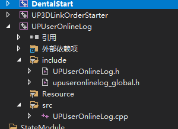
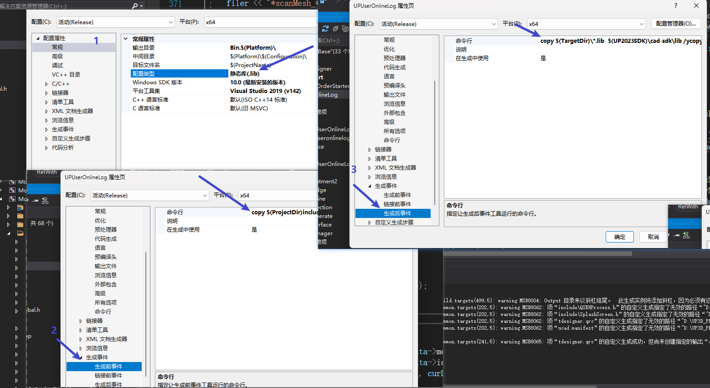

# 这次需求用到了动态库与静态库的生成，这里记录一下

## 静态库
****************
静态库比较生成比较简单

首先编写好相应的工程文件，如图：这里准备好了一个UPUserOnlineLog的工程

之后在属性选项中作相应的配置，注意，静态库没有链接器选项

这里主要分为三步：

1. 首先是 常规中，配置好输出目录，也就是你的pdb文件以及lib文件将会存放的位置。
一般这里我动态库取名：``\Bin.x64``,静态库取名``\lib.x64``,此外，还要注意调试选项中设置好当前工作路径，默认为工程文件所在的路径

2. 这里生成前事件，我需要把.h文件拷贝到sdk，目的是其他调用该工程文件的地方不需要在引入该头文件，而是去公共头文件sdk文件下自动引用

3. 生成后事件目的和2相同，将工程编译后产生的pdb，lib文件复制到集成环境的工作路径下，而不需要再做复杂的配置，至此，静态库已经生成完毕。
