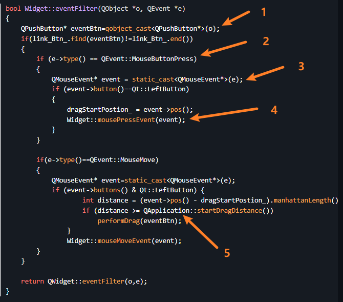

# 花了几天时间简单学习了一下QT的鼠标拖拽事件，摸鱼时间记一下笔记

## 一般的鼠标事件主要包括
1. 鼠标按下松开
    1. **mousePressEvent**
    2. mouseReleaseEvent
2. 鼠标移动
    1. **mouseMoveEvent**
3. 鼠标滚动
    1. mouseWheelEvent

此外，还有鼠标拖拽事件。主要包括:
1. dragEnterEvent
2. dragLeaveEvent
3. dragMoveEvent
4. **dropEvent**

***
下面举几个案例
```C++
bool Widget::eventFilter(QObject *o, QEvent *e)
{
    QPushButton* eventBtn=qobject_cast<QPushButton*>(o);
    if(link_Btn_.find(eventBtn)!=link_Btn_.end())
    {
        if (e->type() == QEvent::MouseButtonPress)
        {
            QMouseEvent* event = static_cast<QMouseEvent*>(e);
            if (event->button()==Qt::LeftButton)
            {
                dragStartPostion_ = event->pos();
                Widget::mousePressEvent(event);
            }
        }

        if(e->type()==QEvent::MouseMove)
        {
            QMouseEvent* event=static_cast<QMouseEvent*>(e);
            if (event->buttons() & Qt::LeftButton) {
                    int distance = (event->pos() - dragStartPostion_).manhattanLength();
                    if (distance >= QApplication::startDragDistance())
                        performDrag(eventBtn);
                }
                Widget::mouseMoveEvent(event);
        }
    }

    return QWidget::eventFilter(o,e);
}
```

这是一个事件过滤器,记得要给组件安装事件过滤器：``QWidegt::installFilterEvent(this)``。这里类似于抓取了子组件的鼠标按下以及鼠标移动事件,下面具体描述5点内容。


1：这里是强制类型转换，可以通过源对象得到对应的组件，即``QObject->QWidget``，还有安全检查。

2： 注意函数的输入为``QEvent *e``,所以``e->type()``用于判断是鼠标什么事件，可以是按下，移动，滚动事件

3：这里也是类型转换，将QEvent\* 转为具体的鼠标事件类，这里转为 QMouseEvent\*。

4：这里的目的是为了继续执行widget的事件，感觉写的还有点问题，如果函数返回false，则事件的传递链会继续向下，即具体到特定的按钮。若返回true，则阻断了信号的继续传递。

5：这里纯纯就是一个惯例了，当距离大于Qt自带的曼哈顿距离，那就判断为真的在拖拽。
***

此处描述了拖拽事件中的拖事件，即左键按下，并移动一段距离。
``perforDrag``函数为自定义的行为，这里我想记录一些信息，具体如下：

```C++
void Widget::performDrag(QWidget* widget)
{
    QMimeData *mimeData = new QMimeData;
    mimeData->setText(widget->objectName());
    qDebug()<<("%f",mimeData);
    QDrag *drag = new QDrag(widget);
    drag->setMimeData(mimeData);
    //drag->setPixmap(QPixmap(":/images/person.png"));
    if (drag->exec(Qt::MoveAction) == Qt::MoveAction);

}
```
这里使用了QMimeData数据对象，保存了对象名，并创建了拖拽对象Drag，在其中保存了相关的数据。QDrag::exec() 会阻塞拖动的操作，直到用户完成操作或者取消操作。它接受不同类型的动作作为参数，返回值是真正执行的动作。这些动作的类型一般为 Qt::CopyAction，Qt::MoveAction 和 Qt::LinkAction。

***
之后，再来看看放对象的行为
```C++
void SubGphItem::dropEvent(QGraphicsSceneDragDropEvent *event)
{
    QMimeData* mimeData=const_cast<QMimeData*>(event->mimeData());
    //\说明被拖拽的对象是grapItem，只有交换或者删除两种功能
    //qDebug()<<mimeData->text();
    if(mimeData->text().indexOf("type:")==0)
    {
        QStringList list=mimeData->text().split('-');
        if(list.size()>=2)
        {
            mimeData->setText(list[1]);
        }

        if(isDeletePanel_==true&&isDraging_==false)
        {
            //qDebug()<<"Need delete widget"<<mimeData->text();
            emit removeGphItem(mimeData);
        }
        if(isExchangePanel_==true&&isDraging_==false)
        {
            //qDebug()<<"Need Exchange between" << mimeData->text()<<" and "<< this->objectName();
            emit exchangeGphItem(this->objectName(),mimeData);
        }
    }
    //\此外，说明被拖拽对象为按钮，强转对象后，将其加入圆盘
    else
    {
        qDebug()<<event->source();
        QPushButton* linkBtn=qobject_cast<QPushButton*>(event->source());
        emit addGphItem(mimeData,linkBtn);
    }

    isDraging_=false;

}

void SubGphItem::dragEnterEvent(QGraphicsSceneDragDropEvent *event)
{
    //这里的含义是该对象允许接收对象
    event->acceptProposedAction();
}

SubGphItem::SubGphItem(QGraphicsPathItem *parent) : QGraphicsPathItem(parent)
{
    //开启鼠标拖拽事件
    this->setAcceptDrops(true);
    //开启鼠标悬浮事件
    this->setAcceptHoverEvents(true);
}
```
从上面来看，就是拿到数据后解析操作，然后判断并发生相应的信号

***
最后，还有一部分就是鼠标的悬浮事件，由于这是图形对象，鼠标事件也有所不同

**鼠标按下事件**
```C++
void SubGphItem::mouseMoveEvent(QGraphicsSceneMouseEvent *event)
{
    if(event->type()==QEvent::GraphicsSceneMouseMove)
    {
        if(event->type()==QMouseEvent::Enter)
        {
            dosomething(...)
        }
        if(event->type()==QMouseEvent::Leave)
        {
            dosomething(...)
        }
    }

    if (event->buttons() & Qt::LeftButton) {
        qreal distance = (event->pos() - dragStartPostion_).manhattanLength();
            if (distance >= QApplication::startDragDistance())
                performDrag();
        }
        QGraphicsPathItem::mouseMoveEvent(event);
}
//悬浮离开事件
void SubGphItem::hoverLeaveEvent(QGraphicsSceneHoverEvent *event)
{
    QRadialGradient gradient(0,0,100);
    gradient.setColorAt(0,Qt::white);
    gradient.setColorAt(1.0,qRgb(200,200,0));
    this->setBrush(gradient);
    QGraphicsItem::hoverLeaveEvent(event);
}
//悬浮进入事件
void SubGphItem::hoverEnterEvent(QGraphicsSceneHoverEvent *event)
{
    QRadialGradient gradient(0,0,100);
    gradient.setColorAt(0,Qt::white);
    gradient.setColorAt(1.0,qRgb(100,100,0));
    this->setBrush(gradient);
    this->setFocus();
    QGraphicsItem::hoverEnterEvent(event);
}
```